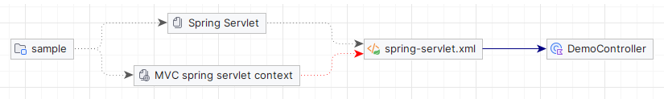

# modules-installer-plugin
Плагин, обеспечивающий преобразование Maven-зависимостей в модули с последующей их установкой на сервер приложений

### Цели создания плагина:
- централизировать управление библиотеками, используемых приложениями WildFly
- облегчить процесс внедрения новых библиотек
- оптимизировать построение WildFly модулей и их зависимостей

# Guide
### 1. Определяем модули в pom.xml
Для начала нам нужен Maven проект, в котором мы планируем описать модули. Это может быть как уже существующий, так и новый проект; главное, чтобы в нём был файл pom.xml. Сам проект будет выступать в роли корневого модуля. 

Для демонстрации я создам пустой проект, у которого нет ничего кроме описания pom.xml:

```xml
<?xml version="1.0" encoding="UTF-8"?>
<project xmlns="http://maven.apache.org/POM/4.0.0"
xmlns:xsi="http://www.w3.org/2001/XMLSchema-instance"
xsi:schemaLocation="http://maven.apache.org/POM/4.0.0 http://maven.apache.org/xsd/maven-4.0.0.xsd">
<modelVersion>4.0.0</modelVersion>
    
    <groupId>org.vniizht</groupId>
    <artifactId>god-module</artifactId>
    <version>demo</version>

    <properties>
        <java.version>1.8</java.version>
        
        <!-- Чтобы избежать возможных проблем с компиляцией, на всякий случай опишем следующее -->
        <project.build.sourceEncoding>UTF-8</project.build.sourceEncoding>
        <maven.compiler.source>${java.version}</maven.compiler.source>
        <maven.compiler.target>${java.version}</maven.compiler.target>
    </properties>

    <!-- Добавим зависимости потяжелее, которые планируем внедрять -->
    <dependencies>
        <dependency>
            <groupId>org.postgresql</groupId>
            <artifactId>postgresql</artifactId>
            <version>42.6.0</version>
        </dependency>

        <dependency>
            <groupId>org.jetbrains.kotlin</groupId>
            <artifactId>kotlin-stdlib-jdk8</artifactId>
            <version>1.6.21</version>
        </dependency>

        <dependency>
            <groupId>org.hibernate</groupId>
            <artifactId>hibernate-core</artifactId>
            <version>5.6.15.Final</version>
        </dependency>

        <dependency>
            <groupId>com.google.guava</groupId>
            <artifactId>guava</artifactId>
            <version>31.1-jre</version>
        </dependency>

        <dependency>
            <groupId>org.apache.poi</groupId>
            <artifactId>poi-ooxml</artifactId>
            <version>5.2.3</version>
        </dependency>
    </dependencies>

    <build>
        <plugins>
            <!-- Сюда в дальнейшем положим наш плагин, об этом в следующем пункте -->
        </plugins>
    </build>
</project>
```

### 2. Добавляем плагин
Для начала следует его установить локально. 
Для этого скачиваем [плагин](https://github.com/CyberShrek/modules-installer-plugin/raw/master/target/modules-installer-plugin-alfa.jar)
и выполняем команду `mvn org.apache.maven.plugins:maven-install-plugin:3.1.1:install-file -Dfile=сюда нужно подставить путь к скачанному файлу`.
Пока такой способ, надеюсь что временный.

После этого мы сможем использовать плагин в нашем pom.xml -> project -> build -> plugins:
```xml
<plugin>
    <artifactId>modules-installer-plugin</artifactId>
    <groupId>org.vniizht</groupId>
    <version>alfa</version>
    <executions>
        <execution>
            <goals><goal>install-to-wildfly</goal></goals>
        </execution>
    </executions>
    <configuration>
        <!-- Сюда добавляем параметры конфигурации -->
    </configuration>
</plugin>
```
Зтем нужно описать в configuration, как и куда мы хотим установить модули. Как минимум нужно указать расположение WildFly в параметре wildflyHome, например:
```xml
<wildflyHome>/home/master/Development/wildfly-20.0.0.Final/</wildflyHome>
```
Плагин преобразует описанные в pom.xml зависимости в дерево модулей и вставит их в папку modules.

Также, для демонстрации, помещу модули в абстрагированную группу, указав параметр groupPrefix:
```xml
<groupPrefix>demo</groupPrefix>
```
Тогда у модулей появится префикс demo, соответственно физически они будут находиться в modules/demo.

[Подробно про параметры конфигурации](#configuration). 

### 3. Устанавливаем
Просто запускаем команду `mvn clean install`. В консоли будет рекурсивно выведено дерево модулей. 
Здесь же можно посмотреть их имена, пути и слоты (фактически это версии библиотек).
Убеждаемся, что команда выполнилась успешно, и перезагружаем сервер.

Теперь на нашем сервере приложений есть модуль god-module.demo и экспортируемые модули, связанные паутиной зависимостей.

### 4. Внедряем
Прежде всего я настоятельно рекомендую создать родительский проект с целью наследовать его прочими WildFly проектами,
что позволит избавить программистов от головной боли с предоставлением наших WildFly-модулей.
 
В качестве родительского проекта может использоваться один-единственный pom.xml:
```xml
<?xml version="1.0" encoding="UTF-8"?>
<project xmlns="http://maven.apache.org/POM/4.0.0" xmlns:xsi="http://www.w3.org/2001/XMLSchema-instance"
         xsi:schemaLocation="http://maven.apache.org/POM/4.0.0 https://maven.apache.org/xsd/maven-4.0.0.xsd">
    <modelVersion>4.0.0</modelVersion>

    <groupId>org.vniizht</groupId>
    <artifactId>parent</artifactId>
    <version>demo</version>

    <!-- Так как нас интересует лишь описание проекта, способ пакетирования укажем pom -->
    <packaging>pom</packaging>

    <!-- Проперти будут доступны наследникам, поэтому их стоит указать здесь -->
    <properties>
        <java.version>1.8</java.version>
        <kotlin.version>1.6.21</kotlin.version>
    </properties>

    <dependencies>
        <!-- Тот самый модуль, который мы создали и разместили на сервере приложений ранее, помещаем со <scope>provided</scope> -->
        <dependency>
            <groupId>org.vniizht</groupId>
            <artifactId>god-module</artifactId>
            <version>demo</version>
            <scope>provided</scope>
        </dependency>

        <!-- Как внедрять Spring, будет дальше, так как это достаточно тяжёлый случай. Поэтому для начала пропишем обычную зависимость spring-webmvc -->
        <dependency>
            <groupId>org.springframework</groupId>
            <artifactId>spring-webmvc</artifactId>
            <version>5.3.27</version>
        </dependency>
    </dependencies>

    <!-- Желательно, но не обязательно, описать build как можно подробнее, чтобы не повторять одно и то же в проектах-наследниках -->
    <build>
        <plugins>
            <!-- А вот это обязательно -->
            <plugin>
                <groupId>org.apache.maven.plugins</groupId>
                <artifactId>maven-war-plugin</artifactId>
                <version>3.3.2</version>
                <configuration>
                    <failOnMissingWebXml>false</failOnMissingWebXml>
                    <archive>
                        <manifestEntries>
                            <!-- !!!ВАЖНО!!! Здесь мы должны явно описать не глобальные (об этом тоже чуть позже) модули через запятую, которые мы хотим внедрить-->
                            <!-- В противном случае WildFly попросту не предоставит модуль -->
                            <!-- Синтаксис прост: имя-двоеточие-слот -->
                            <Dependencies>demo.org.vniizht.god-module:demo</Dependencies>
                        </manifestEntries>
                    </archive>
                </configuration>
            </plugin>
            
            <!-- Так как я использую Котлин, я опишу кое-чего для него -->
            <plugin>
                <groupId>org.jetbrains.kotlin</groupId>
                <artifactId>kotlin-maven-plugin</artifactId>
                <version>${kotlin.version}</version>
                <configuration>
                    <args>
                        <arg>-Xjsr305=strict</arg>
                    </args>
                    <compilerPlugins>
                        <plugin>spring</plugin>
                    </compilerPlugins>
                </configuration>
                <dependencies>
                    <dependency>
                        <groupId>org.jetbrains.kotlin</groupId>
                        <artifactId>kotlin-maven-allopen</artifactId>
                        <version>${kotlin.version}</version>
                    </dependency>
                </dependencies>
                <executions>
                    <execution>
                        <id>compile</id>
                        <goals>
                            <goal>compile</goal>
                        </goals>
                    </execution>
                    <execution>
                        <id>test-compile</id>
                        <goals>
                            <goal>test-compile</goal>
                        </goals>
                    </execution>
                </executions>
            </plugin>
            
            <!-- И плагин, который позволяет деплоить приложение на WildFly -->
            <plugin>
                <groupId>org.wildfly.plugins</groupId>
                <artifactId>wildfly-maven-plugin</artifactId>
                <version>2.1.0.Final</version>
                <configuration>
                    <username>admin</username>
                    <password>admin</password>
                </configuration>
            </plugin>
        </plugins>
    </build>
</project>
```

Далее создаём уже настоящий проект (или даже несколько!), производный от описанного выше pom.xml.
В качестве демонстрации пусть это будет простейший Spring MVC проект с единственным контроллером:



И вот таким вот pom.xml:

```xml
<?xml version="1.0" encoding="UTF-8"?>
<project xmlns="http://maven.apache.org/POM/4.0.0" xmlns:xsi="http://www.w3.org/2001/XMLSchema-instance"
         xsi:schemaLocation="http://maven.apache.org/POM/4.0.0 https://maven.apache.org/xsd/maven-4.0.0.xsd">
    <modelVersion>4.0.0</modelVersion>

    <parent>
        <groupId>org.vniizht</groupId>
        <artifactId>parent</artifactId>
        <version>demo</version>
    </parent>

    <groupId>org.vniizht</groupId>
    <artifactId>sample</artifactId>
    <version>demo</version>
    <name>sample</name>

    <packaging>war</packaging>

</project>
```
Как можно увидеть, Maven конфигурация конечного приложения получилась предельно лаконичной.

DemoController.kt, написанный на внедрённом Kotlin:
```kotlin
package org.vniizht.sample

import org.springframework.web.bind.annotation.GetMapping
import org.springframework.web.bind.annotation.RestController

@RestController
class DemoController {

    // Возвращает небольшое описание экземпляров предоставленных сервером приложений библиотек, чтобы мы могли убедиться, что они действительно внедрены   
    // Для проверки внедрения этого более чем достаточно
    @GetMapping
    fun getClassDescriptions() = setOf(
        getClassDescription("org.postgresql", "Driver"),
        getClassDescription("org.apache.poi", "POIDocument"),
        getClassDescription("org.hibernate", "Hibernate"),
        getClassDescription("com.google.common.base", "Defaults"),
        getClassDescription("org.apache.logging.log4j", "Logger")
    )

    private fun getClassDescription(packageName: String,
                                    className:   String): String =
        "$packageName: ${
            with(Package.getPackage(packageName)) {
                if (this == null) "cannot resolve"
                else implementationVersion ?: "no version"
            }
        } ($className ${
            try {
                Class.forName("$packageName.$className")
                "available"
            } catch (e: ClassNotFoundException) {
                "not available"
            }
        })"
}
```
### 5. Проверяем
Любым удобным способом деплоим приложение. 
Если в логах никаких ошибок нет, смотрим что нам вернёт контроллер приложения:
```json
[
  "org.postgresql: 42.6.0 (Driver available)",
  "org.apache.poi: 5.2.3 (POIDocument available)",
  "org.hibernate: 5.6.15.Final (Hibernate available)",
  "com.google.common.base: no version (Defaults available)",
  "org.apache.logging.log4j: 2.17.2 (Logger available)"
]
```
Как видим, приложение имеет доступ к тем самым библиотекам, которые у нас внедрены со scope=provided. Успех!

### Тяжёлый случай: внедрение Spring Framework и подобного

Как можно было заметить ранее, Спринг не был предоставлен сервером, вместо этого мы его внедряли компиляцией, поскольку иначе
компилятор ругнётся на отстутствие таких модулей как javax.servlet.http и org.jboss.vfs.
"Но как же так, они же ведь системные, к ним должен быть самый приоритетный доступ по умолчанию!" - Нет.
Если мы добавим вручную эти модули, то поймаем уже другую, не менее интересную ошибку: Unable to locate Spring NamespaceHandler for XML schema namespace и тд.
Связано это с тем, что модули, которые мы внедряем с помощью manifestEntries, иницируются в приложении ПОСЛЕ его компиляции! 
То есть мы их можем использовать исключительно как утилиты, это будет отлично работать, но IOC фреймворки, которым нужны библиотеки "здесь и сейчас", упадут.

Однако, это не приговор для наших грандиозных планов.

Как в первом и втором пункте, создаём модуль с плагином:
```xml
<?xml version="1.0" encoding="UTF-8"?>
<project xmlns="http://maven.apache.org/POM/4.0.0" xmlns:xsi="http://www.w3.org/2001/XMLSchema-instance"
         xsi:schemaLocation="http://maven.apache.org/POM/4.0.0 https://maven.apache.org/xsd/maven-4.0.0.xsd">
    <modelVersion>4.0.0</modelVersion>

    <groupId>org.vniizht</groupId>
    <artifactId>spring-module</artifactId>
    <version>demo</version>
    <name>spring-module</name>

    <properties>
        <java.version>1.8</java.version>
    </properties>

    <dependencies>
        <dependency>
            <groupId>org.springframework</groupId>
            <artifactId>spring-webmvc</artifactId>
            <version>5.3.27</version>
        </dependency>
    </dependencies>

    <build>
        <plugins>
            <plugin>
                <artifactId>modules-installer-plugin</artifactId>
                <groupId>org.vniizht</groupId>
                <version>alfa</version>
                <executions>
                    <execution>
                        <goals><goal>install-to-wildfly</goal></goals>
                    </execution>
                </executions>
                <configuration>
                    <!-- Тут всё также -->
                    <wildflyHome>/home/master/Development/wildfly-20.0.0.Final/</wildflyHome>
                    <groupPrefix>demo</groupPrefix>
                    
                    <!-- Атомируем зависимости -->
                    <resourcesInsteadOfDependencies>true</resourcesInsteadOfDependencies>
                    
                    <!-- Делаем модуль глобальным, чтобы он "крутился" на сервере сразу после запуска -->
                    <isGlobal>true</isGlobal>
                    <configFiles>standalone.xml</configFiles>
                </configuration>
            </plugin>
        </plugins>
    </build>
</project>
```
Останавливаем сервер (иначе конфиг standalone.xml не изменится), запускаем `mvn clean install`, запускаем сервер.

Возвращаемся в пункт 4 и в родительском pom.xml заменяем 
```xml
<dependency>
    <groupId>org.springframework</groupId>
    <artifactId>spring-webmvc</artifactId>
    <version>5.3.27</version>
</dependency>
```
на 
```xml
<dependency>
    <groupId>org.vniizht</groupId>
    <artifactId>spring-module</artifactId>
    <version>demo</version>
    <scope>provided</scope>
</dependency>
```
Устанавливаем родителя, устанавливаем и деплоим производное приложение. Если всё сделали правильно, то поведение программы на сервере не изменится, а вот его вес изменится до ничтожных 4kb.


# Configuration
Плагин принимает следующие параметры конфигурации:

- wildflyHome - расположение сервера приложений, обязательный параметр;
- groupPrefix - абстрагированная группа, в которую будет помещён модуль и все его зависимости;
- configFiles - имена конфигурационных файлов, которые будут отредактированы (пока что работает только с параметром isGlobal);
- isGlobal - true либо false, добавляет или наоборот исключает корневой модуль из global-modules в указанных конфигурационных файлах. Использовать с осторожностью, так как это оказывает прямое влияние на все приложения;
- resourcesInsteadOfDependencies - true либо false, изменяет способ внедрения зависимостей в корневой модуль, внедряя их напрямую через ресурсы, что делает модуль практически атомарным;
- installMode: способ установки модулей, всего их три: 
  - MERGE (по умолчанию) - объединяет новые описания ресурсов и зависимостей со старыми (если они есть);
  - UPDATE - заменяет старые модули на новые;
  - REPLACE - полностью заменяет старую группу на новую. Если группа не указана, работает как UPDATE.
  
 
- extraDependencies - имена дополнительных зависимостей через запятую. Синтаксис такой же как у manifestEntries, то есть имя-двоеточие-слот. Действует только на корневой модуль.